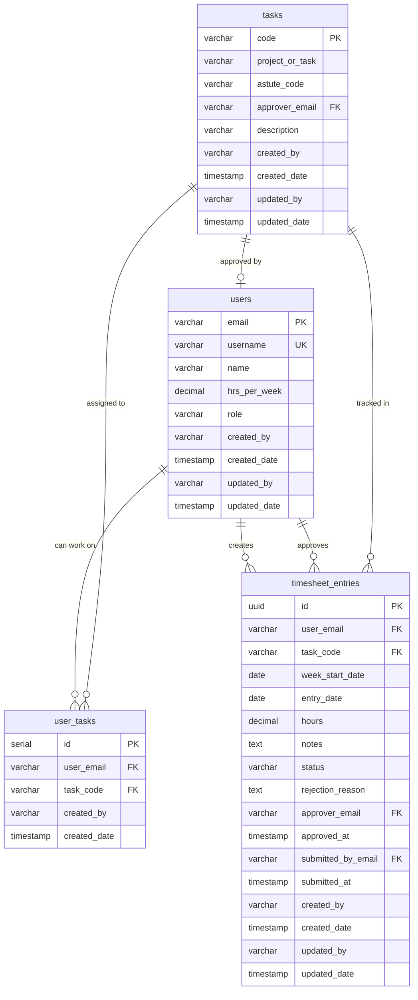

# Stardust Timesheet - Database Schema Specification

**Version:** 1.3  
**Database:** PostgreSQL 16  
**Last Updated:** 2025-12-04

---

## Table of Contents

1. [Overview](#overview)
2. [Entity Relationship Diagram](#entity-relationship-diagram)
3. [Table Definitions](#table-definitions)
4. [Constraints & Business Rules](#constraints--business-rules)
5. [Indexes](#indexes)
6. [Sample Data](#sample-data)
7. [SQL DDL](#sql-ddl)

---

## Overview

### Purpose
This database supports a timesheet entry and approval system with the following key features:
- User authentication via AWS Cognito
- Timesheet entry with weekly cycles (Monday-Sunday)
- Multi-level approval workflow
- Task assignment and tracking
- Integration with Astute system

### Design Principles
- **Cognito-based identification**: Users identified by email (PK) and username (from Cognito)
- **Data integrity**: Comprehensive constraints and foreign keys
- **Audit trail**: Timestamps for creation and modification
- **Performance**: Strategic indexes for common queries
- **Flexibility**: Support for future enhancements

---

## Entity Relationship Diagram



---

## Table Definitions

### 1. `users`

**Purpose:** Stores user information for the timesheet system. Authentication is handled by AWS Cognito; this table is for display names, roles, and foreign key references.

| Column | Type | Constraints | Description |
|--------|------|-------------|-------------|
| `email` | VARCHAR(255) | PRIMARY KEY | User's email address (matches Cognito email) |
| `username` | VARCHAR(255) | UNIQUE, NOT NULL | Cognito username (unique identifier) |
| `name` | VARCHAR(255) | NOT NULL | Display name for the user |
| `hrs_per_week` | DECIMAL(5,2) | DEFAULT 40.00 | Expected hours per week |
| `role` | VARCHAR(20) | NOT NULL, CHECK | User role: 'USER', 'APPROVER', 'ADMIN' |
| `created_by` | VARCHAR(255) | NOT NULL | Email of user who created this record |
| `created_date` | TIMESTAMP | DEFAULT CURRENT_TIMESTAMP | Record creation timestamp |
| `updated_by` | VARCHAR(255) | NOT NULL | Email of user who last updated this record |
| `updated_date` | TIMESTAMP | DEFAULT CURRENT_TIMESTAMP | Last update timestamp |

**Business Rules:**
- Email must be unique and match Cognito user pool email
- Username must be unique and match Cognito username (sub or preferred_username)
- `name` is the display name shown in the UI
- Role determines access permissions in the application
- `hrs_per_week` is informational only (not enforced)

---

### 2. `tasks`

**Purpose:** Defines available tasks/projects that users can log time against.

| Column | Type | Constraints | Description |
|--------|------|-------------|-------------|
| `code` | VARCHAR(50) | PRIMARY KEY | Unique task identifier |
| `project_or_task` | VARCHAR(255) | NOT NULL | Project or Task name |
| `astute_code` | VARCHAR(100) | NULLABLE | External Astute system code |
| `approver_email` | VARCHAR(255) | FK → users(email) | Default approver for this task |
| `description` | VARCHAR(500) | NULLABLE | Task description |
| `created_by` | VARCHAR(255) | NOT NULL | Email of user who created this record |
| `created_date` | TIMESTAMP | DEFAULT CURRENT_TIMESTAMP | Record creation timestamp |
| `updated_by` | VARCHAR(255) | NOT NULL | Email of user who last updated this record |
| `updated_date` | TIMESTAMP | DEFAULT CURRENT_TIMESTAMP | Last update timestamp |

**Business Rules:**
- Task code should be human-readable (e.g., 'DEV-001', 'MEET-001')
- Approver can be NULL (admin approval required)
- Astute code links to external billing system

---

### 3. `user_tasks`

**Purpose:** Junction table defining which tasks each user is allowed to work on.

| Column | Type | Constraints | Description |
|--------|------|-------------|-------------|
| `id` | SERIAL | PRIMARY KEY | Auto-increment ID |
| `user_email` | VARCHAR(255) | FK → users(email), NOT NULL | User email |
| `task_code` | VARCHAR(50) | FK → tasks(code), NOT NULL | Task code |
| `created_by` | VARCHAR(255) | NOT NULL | Email of user who created this assignment |
| `created_date` | TIMESTAMP | DEFAULT CURRENT_TIMESTAMP | Assignment timestamp |

**Business Rules:**
- Each user-task combination must be unique
- Users can only create timesheet entries for assigned tasks
- Deleting a user cascades to remove their task assignments

---

### 4. `timesheet_entries`

**Purpose:** Stores individual timesheet entries with approval workflow tracking.

| Column | Type | Constraints | Description |
|--------|------|-------------|-------------|
| `id` | UUID | PRIMARY KEY, DEFAULT gen_random_uuid() | Unique entry ID |
| `user_email` | VARCHAR(255) | FK → users(email), NOT NULL | Entry owner |
| `task_code` | VARCHAR(50) | FK → tasks(code), NOT NULL | Task being worked on |
| `week_start_date` | DATE | NOT NULL, CHECK (Monday) | Week start (must be Monday) |
| `entry_date` | DATE | NOT NULL, CHECK (within week) | Specific date of work |
| `hours` | DECIMAL(4,2) | NOT NULL, CHECK (0-24, 0.25 increments) | Hours worked |
| `notes` | TEXT | NOT NULL | Work description (mandatory) |
| `status` | VARCHAR(20) | NOT NULL, DEFAULT 'DRAFT', CHECK | Entry status |
| `rejection_reason` | TEXT | NULLABLE | Reason for rejection |
| `approver_email` | VARCHAR(255) | FK → users(email), NULLABLE | Who approved/rejected |
| `approved_at` | TIMESTAMP | NULLABLE | When approved/rejected |
| `submitted_by_email` | VARCHAR(255) | FK → users(email), NULLABLE | Who submitted (usually same as user_email) |
| `submitted_at` | TIMESTAMP | NULLABLE | When submitted for approval |
| `created_by` | VARCHAR(255) | NOT NULL | Email of user who created this entry |
| `created_date` | TIMESTAMP | DEFAULT CURRENT_TIMESTAMP | Record creation |
| `updated_by` | VARCHAR(255) | NOT NULL | Email of user who last updated this entry |
| `updated_date` | TIMESTAMP | DEFAULT CURRENT_TIMESTAMP | Last modification |

**Status Values:**
- `DRAFT` - Being edited by user
- `SUBMITTED` - Awaiting approval
- `APPROVED` - Approved by approver
- `REJECTED` - Rejected by approver (can be re-edited)

**Business Rules:**
- Each user can only have one entry per task per date
- Hours must be in 0.25 increments (quarter hours)
- Daily total hours ≤ 24 (enforced at application level)
- Week start must be Monday
- Entry date must be within the week (Monday to Sunday)
- Notes are mandatory for all entries

---

## Constraints & Business Rules

### Primary Keys
- `users.email` - Natural key (email address)
- `tasks.code` - Natural key (task code)
- `user_tasks.id` - Surrogate key
- `timesheet_entries.id` - UUID for distributed systems

### Foreign Keys

| Child Table | Child Column | Parent Table | Parent Column | On Delete |
|-------------|--------------|--------------|---------------|-----------|
| `tasks` | `approver_email` | `users` | `email` | SET NULL |
| `user_tasks` | `user_email` | `users` | `email` | CASCADE |
| `user_tasks` | `task_code` | `tasks` | `code` | CASCADE |
| `timesheet_entries` | `user_email` | `users` | `email` | CASCADE |
| `timesheet_entries` | `task_code` | `tasks` | `code` | RESTRICT |
| `timesheet_entries` | `approver_email` | `users` | `email` | SET NULL |
| `timesheet_entries` | `submitted_by_email` | `users` | `email` | SET NULL |

### Check Constraints

```sql
-- Users
CHECK (role IN ('USER', 'APPROVER', 'ADMIN'))
CHECK (hrs_per_week >= 0 AND hrs_per_week <= 168)

-- Timesheet Entries
CHECK (status IN ('DRAFT', 'SUBMITTED', 'APPROVED', 'REJECTED'))
CHECK (hours >= 0 AND hours <= 24)
CHECK (MOD(hours * 4, 1) = 0)  -- Quarter hour increments
CHECK (EXTRACT(DOW FROM week_start_date) = 1)  -- Monday
CHECK (entry_date >= week_start_date AND entry_date <= week_start_date + INTERVAL '6 days')
```

### Unique Constraints

```sql
-- User Tasks: Prevent duplicate assignments
UNIQUE (user_email, task_code)

-- Timesheet Entries: One entry per user/task/date
UNIQUE (user_email, task_code, entry_date)
```

---

## Indexes

### Primary Indexes (Automatic)
- `users_pkey` on `users(email)`
- `tasks_pkey` on `tasks(code)`
- `user_tasks_pkey` on `user_tasks(id)`
- `timesheet_entries_pkey` on `timesheet_entries(id)`

### Performance Indexes

```sql
-- Users
CREATE INDEX idx_users_role ON users(role);

-- Tasks
CREATE INDEX idx_tasks_approver ON tasks(approver_email);

-- User Tasks
CREATE INDEX idx_user_tasks_user ON user_tasks(user_email);
CREATE INDEX idx_user_tasks_task ON user_tasks(task_code);

-- Timesheet Entries (Critical for performance)
CREATE INDEX idx_ts_user_week ON timesheet_entries(user_email, week_start_date);
CREATE INDEX idx_ts_status ON timesheet_entries(status);
CREATE INDEX idx_ts_approver ON timesheet_entries(approver_email) WHERE status = 'SUBMITTED';
CREATE INDEX idx_ts_approval_dashboard ON timesheet_entries(status, approver_email, week_start_date) WHERE status = 'SUBMITTED';
CREATE INDEX idx_ts_user_view ON timesheet_entries(user_email, week_start_date, status);
CREATE INDEX idx_ts_export ON timesheet_entries(week_start_date, status);
```

**Index Rationale:**
- `idx_ts_user_week` - User viewing their timesheet for a specific week
- `idx_ts_status` - Filtering by status (common in all queries)
- `idx_ts_approver` (partial) - Approval dashboard (only SUBMITTED entries)
- `idx_ts_approval_dashboard` - Composite for approval queries
- `idx_ts_export` - CSV export queries

---

## Sample Data

### Users (3 users)

```sql
INSERT INTO users (email, username, name, hrs_per_week, role) VALUES
('user@stardust.com', 'user_standard', 'Standard User', 40.00, 'USER'),
('manager@stardust.com', 'manager_one', 'Manager One', 40.00, 'APPROVER'),
('admin@stardust.com', 'admin_user', 'Admin User', 40.00, 'ADMIN');
```

### Tasks (5 tasks)

```sql
INSERT INTO tasks (code, project_or_task, astute_code, approver_email, description) VALUES
('DEV-001', 'Project Alpha | Development', 'AST-1001', 'manager@stardust.com', 'Frontend Development'),
('DEV-002', 'Project Alpha | Development', 'AST-1002', 'manager@stardust.com', 'Backend Development'),
('MEET-001', 'Internal | Meetings', 'AST-2001', 'manager@stardust.com', 'Team Meetings'),
('DES-001', 'Project Alpha | Design', 'AST-1003', 'manager@stardust.com', 'System Design'),
('TEST-001', 'Project Alpha | QA', 'AST-1004', 'manager@stardust.com', 'QA & Testing');
```

### User Tasks (Assignments)

```sql
INSERT INTO user_tasks (user_email, task_code) VALUES
('user@stardust.com', 'DEV-001'),
('user@stardust.com', 'DEV-002'),
('user@stardust.com', 'MEET-001'),
('manager@stardust.com', 'DEV-001'),
('manager@stardust.com', 'MEET-001'),
('manager@stardust.com', 'DES-001');
```

### Timesheet Entries (Sample)

```sql
INSERT INTO timesheet_entries (
    user_email, task_code, week_start_date, entry_date, 
    hours, notes, status
) VALUES
('user@stardust.com', 'DEV-001', '2025-12-01', '2025-12-01', 8.00, 'Implemented login feature', 'DRAFT'),
('user@stardust.com', 'MEET-001', '2025-12-01', '2025-12-01', 1.00, 'Daily standup', 'DRAFT');
```

---

## SQL DDL

See the complete DDL in `init.sql` (to be generated in Step 3).

**Key Features:**
- All tables with proper constraints
- All indexes defined
- Seed data included
- Compatible with PostgreSQL 16
- Ready for Docker initialization
- Application-level audit tracking

---

## Audit Columns Implementation

### Application-Level Audit Tracking

All tables include `created_by` and `updated_by` columns for audit trail purposes. These are managed at the **application level** (Spring Boot), not via database triggers.

**Why Application-Level?**
- Backend connects to PostgreSQL as single user (`stardust_user`)
- Actual users authenticated via AWS Cognito (not PostgreSQL users)
- `current_user` would always be `stardust_user`, not the actual person
- Application extracts email from JWT token for accurate tracking

**Implementation in Spring Boot:**

```java
@MappedSuperclass
@EntityListeners(AuditingEntityListener.class)
public abstract class AuditableEntity {
    
    @Column(name = "created_by", nullable = false, updatable = false)
    @CreatedBy
    private String createdBy;
    
    @Column(name = "created_date", nullable = false, updatable = false)
    @CreatedDate
    private LocalDateTime createdDate;
    
    @Column(name = "updated_by", nullable = false)
    @LastModifiedBy
    private String updatedBy;
    
    @Column(name = "updated_date", nullable = false)
    @LastModifiedDate
    private LocalDateTime updatedDate;
}

// Configure auditor provider to extract email from JWT
@Configuration
@EnableJpaAuditing
public class AuditConfig {
    
    @Bean
    public AuditorAware<String> auditorProvider() {
        return () -> {
            // Extract email from Spring Security context (JWT)
            Authentication auth = SecurityContextHolder.getContext().getAuthentication();
            if (auth != null && auth.getPrincipal() instanceof Jwt) {
                Jwt jwt = (Jwt) auth.getPrincipal();
                return Optional.ofNullable(jwt.getClaimAsString("email"));
            }
            return Optional.of("system");
        };
    }
}
```

**Benefits:**
- ✅ Accurate tracking of who created/modified records
- ✅ Works seamlessly with Cognito authentication
- ✅ No database triggers to maintain
- ✅ Full control in application code
- ✅ Easy to test and debug

---

## Notes

### Future Enhancements
- Add `is_active` flags for soft deletion
- Add `last_modified_by_email` for audit trail
- Consider partitioning `timesheet_entries` by `week_start_date` for large datasets
- Add materialized views for reporting

### Migration Considerations
- Use numbered migration scripts for schema changes
- Always test migrations on a copy of production data
- Consider using Flyway or Liquibase for version control

### Performance Tuning
- Monitor slow queries with `pg_stat_statements`
- Adjust indexes based on actual query patterns
- Consider archiving old timesheet entries (>1 year)
